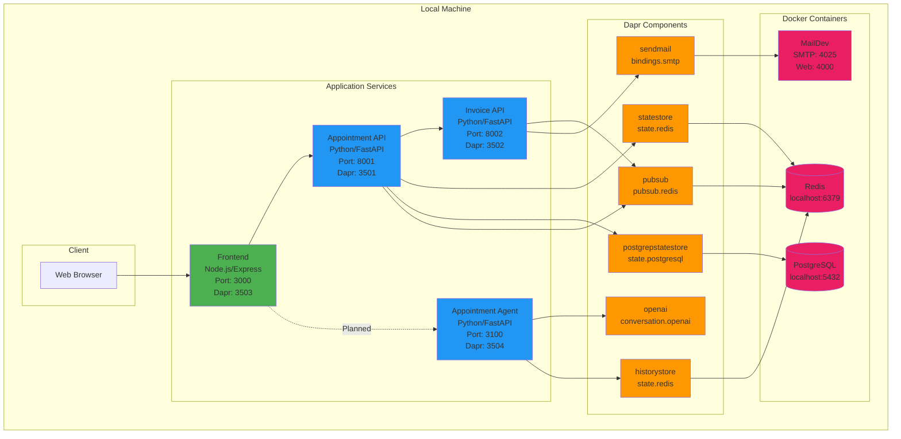
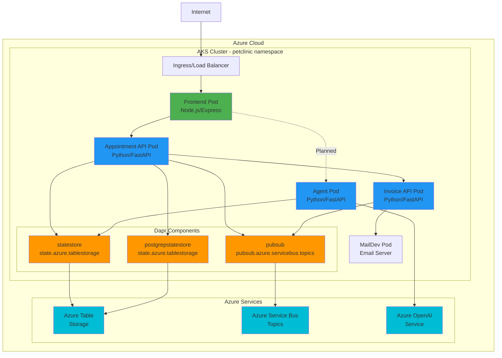

# Dapr Pet Clinic

A microservices-based Pet Clinic application built with Dapr (Distributed Application Runtime), featuring appointment scheduling, invoicing, email notifications, and an AI-powered agent assistant.

## Architecture

### Local Development Architecture



### Kubernetes (AKS) Architecture



## Services

| Service                     | Technology          | Port | Dapr App ID           | Dapr HTTP Port | Description                                                                         |
| --------------------------- | ------------------- | ---- | --------------------- | -------------- | ----------------------------------------------------------------------------------- |
| **Frontend**          | Node.js/Express/EJS | 3000 | `frontend`          | 3503           | Web UI for managing appointments                                                    |
| **Appointment API**   | Python/FastAPI      | 8001 | `appointment-api`   | 3501           | Manages appointments, owners, and animals                                           |
| **Invoice API**       | Python/FastAPI      | 8002 | `invoice-api`       | 3502           | Handles invoicing and email notifications                                           |
| **Appointment Agent** | Python/FastAPI      | 3100 | `appointment-agent` | 3504           | AI-powered assistant for appointment management (integration with frontend planned) |

## Dapr Components

### Local Development Components

**Location**: `components/local/` (copy to `C:\Users\<username>\.dapr\components`)

For local development, Dapr components are defined in the `components/local` directory. Copy these files to your user profile's `.dapr\components` directory, or use the `--resources-path` flag with `dapr run` to point to this directory.

| Component                    | Type                    | Description                                       |
| ---------------------------- | ----------------------- | ------------------------------------------------- |
| **statestore**         | `state.redis`         | Redis state store for application state           |
| **historystore**       | `state.redis`         | Redis state store for history tracking            |
| **postgrepstatestore** | `state.postgresql`    | PostgreSQL state store for appointment data       |
| **pubsub**             | `pubsub.redis`        | Redis pub/sub for local event messaging           |
| **sendmail**           | `bindings.smtp`       | SMTP binding for email notifications (MailDev)    |
| **openai**             | `conversation.openai` | Azure OpenAI conversation component for the agent |

### Kubernetes/Production Components

**Location**: `k8s/` directory in the project

For cloud/AKS deployment, Dapr components are defined as Kubernetes resources and applied to the cluster.

| Component                    | Type                               | Description                              |
| ---------------------------- | ---------------------------------- | ---------------------------------------- |
| **statestore**         | `state.azure.tablestorage`       | Azure Table Storage for state management |
| **postgrepstatestore** | `state.azure.tablestorage`       | Azure Table Storage for PostgreSQL state |
| **pubsub**             | `pubsub.azure.servicebus.topics` | Azure Service Bus for pub/sub messaging  |

## Prerequisites

### Local Development

- [Docker Desktop](https://www.docker.com/products/docker-desktop)
- [Dapr CLI](https://docs.dapr.io/getting-started/install-dapr-cli/)
- [Python 3.9+](https://www.python.org/downloads/)
- [Node.js 18+](https://nodejs.org/)
- [Redis](https://redis.io/download/) (or use Docker)
- [Azure CLI](https://docs.microsoft.com/en-us/cli/azure/install-azure-cli) (for AKS deployment)
- [kubectl](https://kubernetes.io/docs/tasks/tools/) (for AKS deployment)

### Azure Resources (for AKS deployment)

- Azure Kubernetes Service (AKS) cluster
- Azure Container Registry (ACR)
- Azure Table Storage account
- Azure Service Bus namespace
- Azure OpenAI service

## Local Development Setup

### 1. Initialize Dapr

```powershell
dapr init
```

### 2. Start Infrastructure Services

#### PostgreSQL Database

```powershell
# Pull PostgreSQL image
docker pull postgres:14.19-trixie

# Stop and remove existing container (if any)
docker stop postgres-sql
docker rm postgres-sql

# Run PostgreSQL container
docker run --name postgres-sql -e POSTGRES_PASSWORD=mysecretpassword -p 5432:5432 -d postgres
```

#### MailDev (Email Testing)

```powershell
docker run -d -p 4000:1080 -p 4025:1025 --name dtc-maildev maildev/maildev:2.0.5
```

Access MailDev UI at: http://localhost:4000

### 3. Install Service Dependencies

#### Appointment API

```powershell
cd src/appointment-api
pip install -r requirements.txt
```

#### Invoice API

```powershell
cd src/invoice-api
pip install -r requirements.txt
```

#### Appointment Agent

```powershell
cd src/agent
pip install -r requirements.txt
```

#### Frontend

```powershell
cd src/frontend
npm install
```

### 4. Configure Local Components

#### Copy Dapr Components

Copy all component files from `components/local/` to `C:\Users\<username>\.dapr\components\`:

```powershell
Copy-Item -Path "components\local\*" -Destination "$env:USERPROFILE\.dapr\components\" -Force
```

Or use the `--resources-path` flag when running services (see step 5).

#### Configure Azure OpenAI (for Agent)

Update `components/local/openai.yaml` with your Azure OpenAI credentials before copying:

```yaml
metadata:
  - name: key
    value: <YOUR-AZURE-OPENAI-KEY>
  - name: endpoint
    value: <YOUR-AZURE-OPENAI-ENDPOINT>
```

The default configurations for Redis, PostgreSQL, and MailDev match the Docker setup in step 2.

### 5. Run Services

Open separate terminal windows for each service:

#### Terminal 1: Appointment API

```powershell
cd src/appointment-api
dapr run --app-port 8001 --app-id appointment-api --app-protocol http --dapr-http-port 3501 -- python main.py
```

#### Terminal 2: Invoice API

```powershell
cd src/invoice-api
dapr run --app-port 8002 --app-id invoice-api --app-protocol http --dapr-http-port 3502 -- python main.py
```

#### Terminal 3: Appointment Agent

```powershell
cd src/agent
dapr run --app-port 3100 --app-id appointment-agent --app-protocol http --dapr-http-port 3504 -- python main.py
```

#### Terminal 4: Frontend

```powershell
cd src/frontend
dapr run --app-id frontend --app-port 3000 --dapr-http-port 3503 -- node server.js
```

### 6. Access the Application

- **Frontend**: http://localhost:3000
- **MailDev**: http://localhost:4000
- **Appointment API**: http://localhost:8001
- **Invoice API**: http://localhost:8002
- **Appointment Agent**: http://localhost:3100

## AKS Deployment

### Required Azure Resources

Before deploying to AKS, create the following Azure resources:

#### Core Infrastructure

- **Azure Kubernetes Service (AKS)** - Kubernetes cluster to host the application
- **Azure Container Registry (ACR)** - Private container registry for Docker images (attach to AKS for seamless image pulling)

#### Application Dependencies

- **Azure Storage Account** - For Dapr state management components
  - You need to create two tables: `statestore` and `postgrepstatestore`
  - Save the account name and access key
- **Azure Service Bus** - For pub/sub messaging
  - Create a namespace and note the connection string
  - Topics will be created automatically by Dapr
- **Azure OpenAI** - For the appointment agent AI capabilities
  - Deploy a GPT model (e.g., gpt-4o-mini)
  - Note the endpoint and API key

Deployment Steps

### 1. Install Dapr on AKS

Initialize Dapr on your Kubernetes cluster:

```powershell
dapr init -k
```

Verify Dapr is running by checking the dapr-system namespace for running pods.

### 2. Create Application Namespace

Apply the namespace configuration:

```powershell
kubectl apply -f k8s/namespace.yml
```

### 3. Configure and Deploy Dapr Components

Update the following component files in `k8s/` with your Azure resource details:

**k8s/statestore.yml**

- Component: `statestore`
- Type: Azure Table Storage
- Required: Storage account name, account key, table name

**k8s/postgrepstatestore.yml**

- Component: `postgrepstatestore`
- Type: Azure Table Storage
- Required: Storage account name, account key, table name

**k8s/pubsub.yml**

- Component: `pubsub`
- Type: Azure Service Bus Topics
- Required: Service Bus connection string

Deploy all Dapr components to the cluster:

```powershell
kubectl apply -f k8s/statestore.yml
kubectl apply -f k8s/postgrepstatestore.yml
kubectl apply -f k8s/pubsub.yml
```

### 4. Build and Push Container Images

Build Docker images for all services and push them to your Azure Container Registry:

**Services to build:**

- Appointment API (`src/appointment-api/Dockerfile`)
- Invoice API (`src/invoice-api/Dockerfile`)
- Frontend (`src/frontend/Dockerfile`)

Tag images with your ACR name: `<acr-name>.azurecr.io/<service-name>:latest`

### 5. Update Kubernetes Manifests

Update the image references in the deployment manifests with your ACR name:

- `k8s/appointement-api.yml`
- `k8s/invoice-api.yml`
- `k8s/frontend.yml`

### 6. Deploy Application Services

Apply the Kubernetes manifests in this order:

```powershell
# Deploy email testing service
kubectl apply -f k8s/maildev.yml

# Deploy Appointment API
kubectl apply -f k8s/appointement-api.yml

# Deploy Invoice API
kubectl apply -f k8s/invoice-api.yml

# Deploy email service configuration
kubectl apply -f k8s/email.yml

# Deploy Frontend
kubectl apply -f k8s/frontend.yml
```

Verify deployment:

```powershell
kubectl get pods -n petclinic
kubectl get services -n petclinic
```

### 7. Access the Application

Once deployed, access the frontend service via its external IP address or configure an Ingress controller for custom domain routing.

## API Testing

Each service includes a `test.http` file for testing APIs. You can use REST Client extension in VS Code or similar tools.

- Appointment API: `src/appointment-api/test.http`
- Invoice API: `src/invoice-api/test.http`
- Agent API: `src/agent/test.http`

## Project Structure

```
daprPetClinic/
├── components/
│   └── local/                    # Local Dapr components
│       ├── statestore.yaml       # Copy to: C:\\Users\\<username>\\.dapr\\components
│       ├── historystore.yaml
│       ├── postgrepstatestore.yaml
│       ├── pubsub.yaml
│       ├── sendmail.yaml
│       └── openai.yaml
├── infra/                        # Infrastructure as Code (Bicep)
│   ├── main.bicep
│   ├── main.bicepparam
│   └── modules/
├── k8s/                          # Kubernetes manifests
│   ├── namespace.yml
│   ├── appointement-api.yml
│   ├── invoice-api.yml
│   ├── frontend.yml
│   ├── email.yml
│   ├── maildev.yml
│   ├── statestore.yml
│   ├── postgrepstatestore.yml
│   └── pubsub.yml
└── src/
    ├── agent/                    # AI Agent service
    │   ├── main.py
    │   ├── components/
    │   ├── models/
    │   ├── routes/
    │   └── tools/
    ├── appointment-api/          # Appointment management service
    │   ├── main.py
    │   ├── Dockerfile
    │   ├── models/
    │   ├── routes/
    │   └── services/
    ├── invoice-api/              # Invoicing service
    │   ├── main.py
    │   ├── Dockerfile
    │   ├── models/
    │   ├── services/
    │   └── templates/
    └── frontend/                 # Web UI
        ├── server.js
        ├── Dockerfile
        ├── models/
        ├── public/
        ├── routes/
        ├── services/
        └── views/
```

## Technologies Used

- **Dapr**: Distributed Application Runtime
- **Python**: Backend services (FastAPI)
- **Node.js**: Frontend (Express, EJS)
- **PostgreSQL**: Database
- **Redis**: State management (local)
- **Azure Table Storage**: State management (production)
- **Azure Service Bus**: Pub/Sub messaging
- **Azure OpenAI**: AI agent capabilities
- **Docker**: Containerization
- **Kubernetes (AKS)**: Container orchestration
- **Bicep**: Infrastructure as Code
